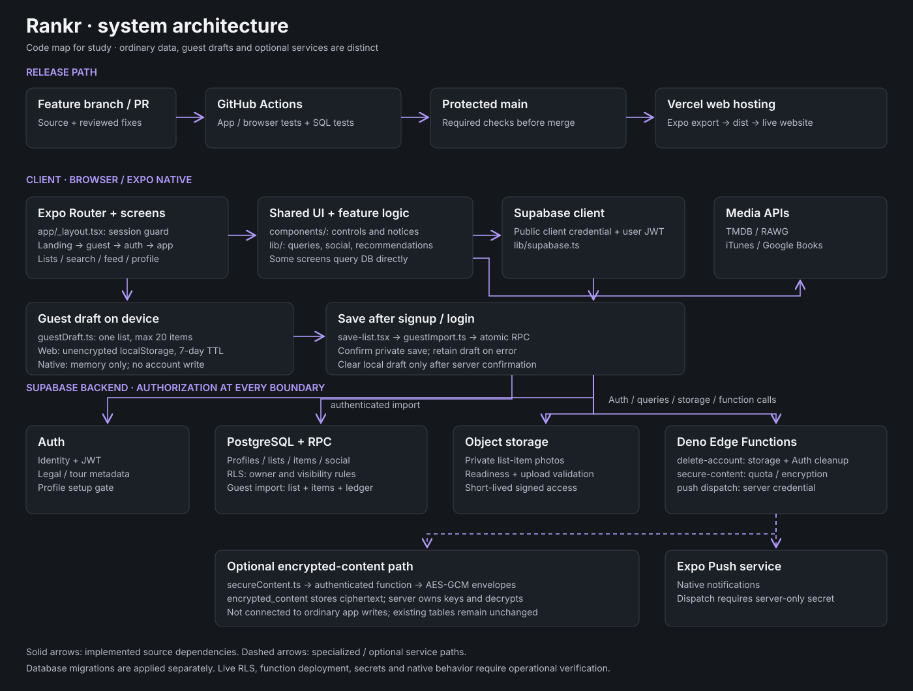
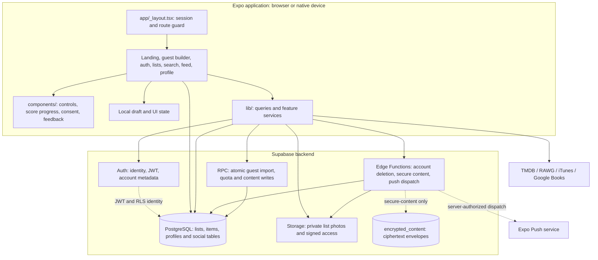
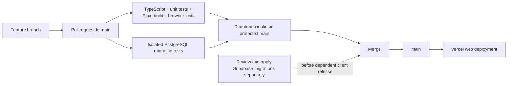

# Rankr architecture study guide

This guide describes the source on `codex/pr-checks-and-list-fixes`, including guest onboarding, score milestones, deletion and CI. It distinguishes implemented code from production setup that still needs verification.



## 1. Start with the four layers

**Presentation:** Expo Router chooses the screen. React Native components render on native devices and through React Native Web in browsers. Web-specific files such as `landing.web.tsx` and `_layout.web.tsx` override their native counterparts. Vercel serves the exported web bundle; it is not the application's database or a custom application server.

**Client logic:** Screens maintain interactive state and call modules in `lib/`. Some operations still query Supabase directly from their screen, particularly list editing and category-specific score generation. `components/` supplies reusable controls and presentation. This is a mixed screen/service architecture rather than a fully centralized API layer.

**Backend:** Supabase provides Auth, PostgreSQL, object storage and Deno Edge Functions. Ordinary client queries use the public client credential plus the signed-in user's JWT. Database row-level security (RLS) must authorize those operations. Edge Functions may use a service-role credential internally; that credential bypasses RLS, so the handler must verify authentication and ownership explicitly. Server secrets belong in Supabase function configuration, never the client bundle.

**External services:** Category search and recommendation modules call TMDB, RAWG, iTunes and Google Books. Native push dispatch goes through Expo. API keys exposed as `EXPO_PUBLIC_*` are visible in the built client.



Solid lines represent source-level dependencies, not a claim that every service is deployed. Dashed lines emphasize conditional or specialized paths.

## 2. Follow a user's first list

```mermaid
sequenceDiagram
  participant U as User
  participant G as /try guest builder
  participant L as Browser localStorage
  participant A as Supabase Auth
  participant S as /save-list
  participant R as rankr_import_guest_list RPC
  participant D as PostgreSQL
  U->>G: Create, add and order favorites
  G->>L: Save one bounded draft
  Note over G,L: Up to 20 items; seven-day inactivity expiry; unencrypted
  G-->>U: At 10 items, show order-based score preview
  U->>G: Save my list
  G->>A: Signup/login if needed
  A-->>S: Authenticated session
  S-->>U: Confirm private account save
  U->>S: Save my list privately
  S->>R: Validated draft with stable UUID
  R->>D: One transaction: list, items and import ledger
  D-->>R: Confirm saved list
  R-->>S: List ID, title and category
  S->>L: Clear draft only after confirmed success
  S-->>U: Short introduction, then saved list
```

A failed import preserves the draft. Retrying the same draft UUID returns the first saved list without overwriting subsequent edits. The server chooses the owner from `auth.uid()` and forces private visibility. A user can save fewer than 10 items; ordering and numeric score visibility are separate concepts.

## 3. Understand scoring and deletion

**Scoring:** `scoreProgress.ts` defines the ten-item visibility threshold. `ScoreProgress.tsx` displays the countdown, progress bar and completion check. Guest previews mirror the existing import formula, evenly spacing scores from 10 to 1 according to order. Saved-list category add screens use sentiment ranges and comparisons. These are different algorithms; the new threshold UI does not unify them. Existing database ranks are retained even while hidden below 10 eligible items. Bookmarks do not count toward the saved-list threshold.

**Deletion:** List screens ask for confirmation through `confirmListDeletion.ts`. Browsers use `window.confirm`; native uses `Alert`. `deleteList.ts` verifies the signed-in user, filters by list and owner, and requires a returned deleted row. Errors or zero rows leave the UI intact. Only confirmed success clears a matching active-list selection and removes the list. Related-row removal depends on deployed foreign keys/cascades; mocked browser tests do not prove production cleanup.

## 4. Module map

| Module or area | What it does | Main dependencies |
|---|---|---|
| `app/_layout.tsx` | Loads session; legal/profile gates; offers a retained draft; selects full/short onboarding; installs shared providers. | Auth, onboarding, legal version, guest draft, ListContext, Toast |
| `app/landing.web.tsx`, `lib/landing.css` | Web marketing page and guest entry points. | Licensed local catalog and branding |
| `app/(auth)/`, `app/consent.tsx`, `app/(onboarding)/create-profile.tsx` | Signup/login, consent and minimum profile setup. | Auth, profiles, legal metadata |
| `app/try.tsx`, `lib/guestDraft.ts` | Account-free list editing and local retention. | Browser localStorage; native memory fallback |
| `app/save-list.tsx`, `lib/guestImport.ts` | Explicit private import confirmation, auth check and one RPC call. | `rankr_import_guest_list` |
| `lib/onboardingState.ts`, `lib/onboarding.ts`, `app/walkthrough.tsx` | Pure onboarding decisions, account/list lookup and walkthrough completion metadata. | Auth metadata, profiles, lists |
| `lib/scoreProgress.ts`, `components/ScoreProgress.tsx` | Ten-item visibility rule and accessible progress UI. | Theme and current eligible count |
| `app/(tabs)/lists/`, `lib/ListContext.tsx` | Create, display, edit and reorder lists; retain current list selection. | lists, list_items, profile identity |
| `lib/deleteList.ts`, `lib/confirmListDeletion.ts` | Verified owner-scoped deletion and platform confirmation. | Auth and PostgreSQL |
| `app/(tabs)/search/`, `lib/apiKeys.ts` | Category search, adding items, initial scores and comparisons. | Provider APIs, list_items, sentiments |
| `lib/ComparisonSheet.tsx` | Reusable head-to-head choice interface. | Choice callbacks, native haptics |
| `app/item/`, `lib/itemDetails.ts` | Provider metadata for a title. | TMDB, RAWG, iTunes, Google Books |
| `app/list-item/`, `lib/queries.ts` | Stored item detail with list/owner context; reusable read queries. | list_items, lists, profiles |
| `lib/feed.ts`, `lib/posts.ts` | Assemble activity and manage posts. | follows, lists/items, profiles, posts |
| `lib/social.ts`, `lib/engagement.ts` | Follows, likes, comments and watched-with tags. | Social tables and Auth |
| `lib/recommendations.ts`, `lib/recommendationsCache.ts` | Fetch/rank provider suggestions and cache repeated requests. | Existing favorites, provider APIs |
| `lib/insights.ts`, `components/InsightSection.tsx` | Summarize user media activity for insight screens. | Stored list/item data |
| `lib/profile.ts`, `lib/moderation.ts` | Profile operations, blocks and reporting. | profiles, user_blocks, reports |
| `lib/photoUpload.ts`, `lib/photoReferences.ts`, `components/UserPhoto.tsx` | Validate photo references, upload private photos and resolve signed access. | Storage and readiness RPC |
| `lib/account.ts` | Account data export and server-authoritative deletion request. | Client read queries; delete-account function |
| `lib/secureContent.ts` | Optional encrypted-store client API. Not wired into ordinary app content writes. | secure-content function |
| `supabase/functions/secure-content/` | Authenticate, enforce owner/CAS/quota and encrypt/decrypt payloads. | encrypted_content and RPCs |
| `supabase/functions/_shared/content-crypto.ts` | AES-GCM envelopes, random nonce, contextual binding and key selection. | Server keyring secrets |
| `supabase/functions/delete-account/` | Verify identity, remove account storage and delete Auth identity. | Storage and Auth admin API |
| `lib/notifications.ts`, `lib/pushTokens.ts` | Read/group notifications and register device tokens. | Notification/social data, push_tokens |
| `supabase/functions/send-push-notification/` | Dispatch push only with a dedicated server credential. | push_tokens, Expo Push |
| `lib/feedback.ts`, `lib/diagnostics.ts` | Voluntary feedback and opt-in technical details. | feedback table and in-app error context |
| `lib/legal.ts`, legal routes, `components/ConsentCheck.tsx` | Versioned agreement and policy presentation. | Auth metadata and public contact config |
| `lib/theme.ts`, `lib/responsive.ts`, `lib/a11y.ts`, `components/` | Tokens, responsive behavior, reduced motion and shared UI. | React Native/Web |
| `lib/draftStorage.ts`, `.web.ts` | Composer draft storage distinct from guest-list persistence. | Platform-specific local state |
| `.github/workflows/ci.yml`, `tests/`, `scripts/serve-web.cjs` | PR tests, isolated backend fixtures and local web preview. | GitHub Actions, Node, Chromium, PostgreSQL |

## 5. Database and security boundaries

The main entity relationship is **Auth user → profile and lists → list_items**. Items contain title/provider references, order/score, sentiment, notes and photo references. Social features add follows, likes, comments, posts, blocks, reports and device tokens. Historical schema descriptions live in [database-schema.md](database-schema.md) and phase SQL files; they are not proof of the deployed schema.

The managed migrations currently include:

| Migration | Purpose |
|---|---|
| `202609300000` | Missing `user_blocks` prerequisite. |
| `202609300001` | Private list-photo bucket/policies, authorization helpers and readiness checks. |
| `202609300002` | Encrypted-content table, quota and optimistic-concurrency write RPCs. |
| `202609300003` | Transactional, private, idempotent guest-list import and service-only ledger. |

**Important boundary:** regular profiles, lists, items, posts and comments still use their existing application tables. Adding `encrypted_content` does not automatically encrypt those records. No screen currently imports `secureContent`. Deploying the Edge Function and configuring its keyring are separate operational steps; production encryption coverage is not asserted here.

## 6. Development and release path



GitHub Actions does not apply live database migrations. Vercel builds `npm run vercel-build` and publishes `dist` using the routing in `vercel.json`. A workflow triggered after a push does not hold back Vercel; required PR checks before merging provide that gate. Native releases use a separate Expo/device build process.

## 7. A suggested study order

1. Read `app/_layout.tsx` and trace how a session changes navigation.
2. Follow `app/try.tsx` → `guestDraft.ts` → `save-list.tsx` → `guestImport.ts` → migration `003`.
3. Read a list screen and category search screen to distinguish stored order, numeric scores and comparison logic.
4. Follow `deleteOwnedList` and the failure tests to see why a returned row matters under RLS.
5. Study `queries.ts`, then feed/social/engagement services to see how screens obtain joined data.
6. Compare a normal client database query with the authenticated secure-content Edge Function. Notice where the service-role credential changes the responsibility for authorization.
7. Run the test commands in [TESTING.md](TESTING.md), then inspect a PR's checks and screenshot artifact.

The diagrams describe code and intended deployment boundaries. Real OAuth/email callbacks, native devices, live RLS/cascades, Edge Function deployment and encryption key configuration still need their respective operational checks.
